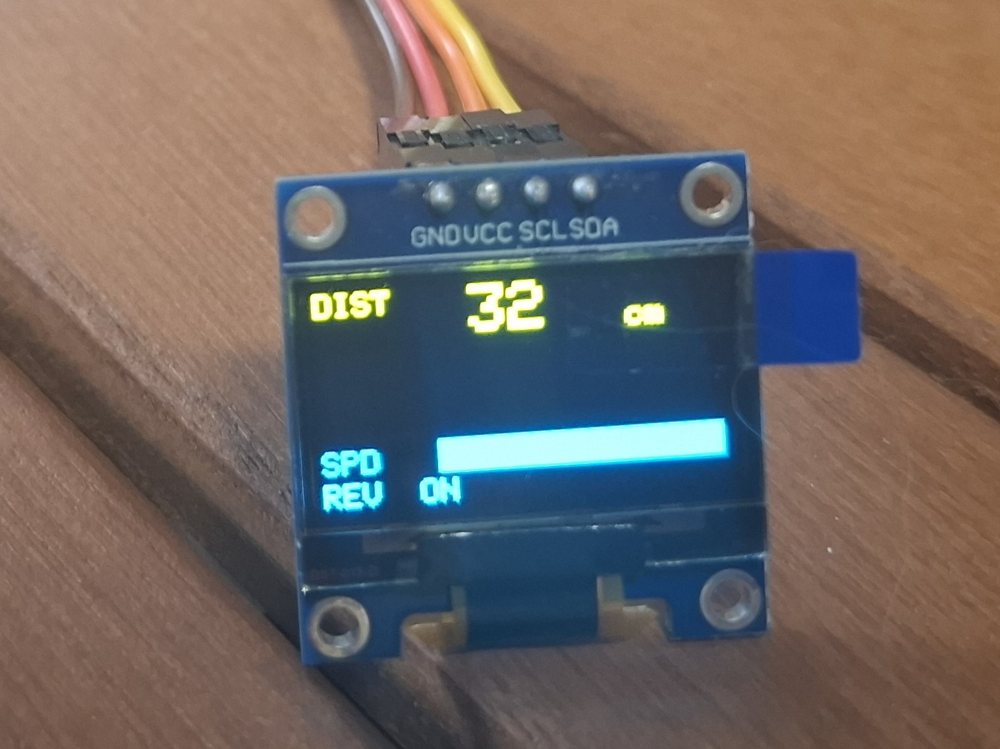

# Distance Motor

An Arduino Uno project that controls a DC motor's speed based on data from an HC-SR04 ultrasonic sensor. The closer an object gets, the slower the motor runs — and if it gets too close, the motor stops and triggers a buzzer and LED alert. The motor's direction and on/off are toggled with physical switches, and all live data is displayed on an OLED screen.

---

## Demo

[Watch the demo](https://drive.google.com/file/d/1Nez13qiMHCanN5rYwEORCZDi-DmvZulN/view?usp=sharing)

---

## Features

- **Speed control** — motor PWM is mapped from sensor distance (5–32 cm range)
- **Danger zone** — motor stops and buzzer/LED turn on when an object is within 5 cm
- **Direction toggle** — flip motor direction via a switch; 
- **On/Off toggle** — enable or disable the motor independently of distance
- **OLED display** — live distance, speed bar, direction, motor state, and danger label
- **9V external battery** — powers the motor independently from the Arduino 5 V rail

---

## Components

| Component | Description |
|---|---|
| Arduino Uno | Main microcontroller |
| HC-SR04 | Ultrasonic distance sensor |
| L293D | H-bridge motor driver IC |
| DC motor | Driven via L293D |
| SSD1306 OLED (0.96") | I2C display (128×64) |
| Piezo buzzer | Danger alert |
| Red LED | Danger indicator |
| Push buttons | Direction and on/off toggles |
| Decoupling capacitor | Stabilises HC-SR04 power rail |
| 9V battery + snap | External motor power supply |
| Jumper wires | Breadboard connections |
| Resistors | Current limiting for LED and buttons |

---

## Wiring

| Signal | Arduino Pin |
|---|---|
| L293D IN1 (motor dir A) | D2 |
| L293D IN2 (motor dir B) | D3 |
| L293D EN1 (motor speed) | D9 |
| Direction switch | D4 |
| On/Off switch | D5 |
| HC-SR04 TRIG | D6 |
| HC-SR04 ECHO | D7 |
| Piezo buzzer | D10 |
| LED | D13 |
| OLED SDA | A4 |
| OLED SCL | A5 |

> **Power note:** the 9V battery feeds the L293D's V_motor pin (pin 8) directly. Arduino 5V supplies the L293D logic (pin 16) and all other components. Add a 100 µF decoupling capacitor across the HC-SR04 VCC/GND pins to reduce false readings from motor noise.

---

## How It Works

### Distance → Speed

```cpp
const int DIST_FULL_SPEED = 32;  
const int DIST_DANGER     = 5; 

int distanceToSpeed(int cm) {
  if (cm < 0)                  return 0;   // no echo / out of range
  if (cm <= DIST_DANGER)       return 0;   // danger
  if (cm >= DIST_FULL_SPEED)   return 255; // full speed
  return constrain(map(cm, DIST_DANGER, DIST_FULL_SPEED, 70, 255), 110, 255);
}
```

### Shoot-through protection

Before reversing direction, the enable pin is brought to 0 with a 10 ms pause:

```cpp
void setMotorDirection(bool forward) {
  analogWrite(ENABLE_PIN, 0);
  delay(10);

  digitalWrite(CONTROL_PIN_1, forward ? HIGH : LOW);
  digitalWrite(CONTROL_PIN_2, forward ? LOW  : HIGH);
}
```

### Debounced rising-edge detection

Both switches use a shared helper that rejects bounces shorter than 50 ms and only fires on the LOW→HIGH transition:

```cpp
bool risingEdge(int pin, bool &lastState, unsigned long &lastTime) {
  bool reading = digitalRead(pin);
  if (reading != lastState && (millis() - lastTime) > DEBOUNCE_MS) {
    lastTime  = millis();
    lastState = reading;
    return (reading == HIGH);
  }
  return false;
}
```

---
### OLED layout



When the danger condition is active, <span style="color:cyan">!! STOP !!</span> appears on the bottom row.

---

## Key Concepts Learned

- **L293D H-bridge** — controlling DC motor speed and direction
- **HC-SR04 ultrasonic sensor** — triggering a 10 µs pulse and measuring echo duration with `pulseIn()`, with a 15 ms timeout to cap range at ~2.5 m
- **9V battery wiring** — isolating the motor power from the rest of the breadboard + decoupling capacitors
- **Distance mapping** — using the sensor value to transfer it into cm then into actual DC motor speed

---
