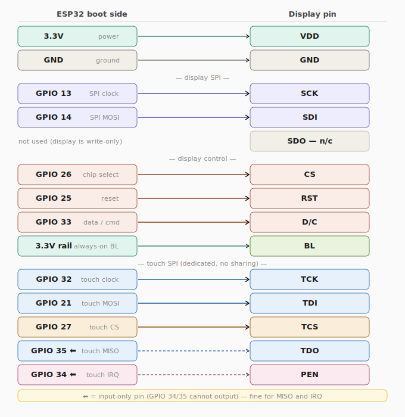

# Smart Whiteboard — Project Documentation

> **ESP32-powered collaborative drawing board.** Users connect to a Wi-Fi network, open a browser, and draw together in real-time. Every stroke is mirrored on the physical 3.5" ILI9488 touchscreen and on every connected browser simultaneously. _(the design of the WebServer is Minecraft inspired)_

---

## Demo

[Watch the demo](https://drive.google.com/file/d/1Cp4gKksS3F5CzJNERemZLCdKmImRGrEj/view?usp=sharing)

---

## Configuration

Remember to update your Wi-Fi credentials in `src/main.cpp`:

```cpp
static const char* AP_SSID = "YOUR_SSID";
static const char* AP_PASS = "YOUR_PASSWORD";
```

---

## Table of Contents

1. [Project Overview](#1-project-overview)
2. [Hardware & Wiring](#2-hardware--wiring)
3. [Architecture](#3-architecture)
4. [Build & Flash (PlatformIO)](#4-build--flash-platformio)
5. [File Structure](#5-file-structure)
6. [Firmware — C++ Source](#6-firmware--c-source)
7. [Frontend — JavaScript & HTML](#7-frontend--javascript--html)
8. [WebSocket Message Protocol](#8-websocket-message-protocol)
9. [Draw Queue (Ring Buffer)](#9-draw-queue-ring-buffer)

---

## 1. Project Overview

Smart Whiteboard is a real-time multiplayer drawing app that runs entirely on an ESP32. It hosts a web server, maintains WebSocket connections with up to 6 users, and mirrors all drawing onto a physical touchscreen — no cloud, no external services.

**What it does:**

- Serves a single-page HTML/JS app from LittleFS flash storage on port 80.
- Broadcasts every drawing event (strokes, shapes, text, erases, clears) to all clients and the physical screen in real-time.
- Persists drawing history to `history.jsonl` so late-joining users see the full canvas.
- Assigns each user a unique color and provides a live chat sidebar.

**Technology stack:**

| Layer           | Technology                               |
| --------------- | ---------------------------------------- |
| Microcontroller | ESP32 (DOIT DevKit v1)                   |
| Display driver  | LovyanGFX (ILI9488 panel, XPT2046 touch) |
| Web server      | ESPAsyncWebServer                        |
| JSON            | ArduinoJson v6                           |
| File system     | LittleFS                                 |
| Frontend        | Vanilla JS, HTML5 Canvas                 |

---

## 2. Hardware & Wiring

The project uses a **3.5" ILI9488 SPI TFT with XPT2046 resistive touch**. The display and touch controller share the same PCB but use **separate SPI buses** (VSPI for display, HSPI for touch) to avoid contention.

### Pin Mapping



### Notes

- Panel runs at **40 MHz** write / 8 MHz read, landscape rotation, 480×320 effective resolution.
- Power via USB — ensure your supply can handle ~400 mA peak (ESP32 Wi-Fi + display backlight).

---

## 3. Architecture

```
Browser (any device on the Wi-Fi network)
        │  HTTP GET /     → serves index.html, js, css from LittleFS
        │  WebSocket /ws  ←→ JSON messages
        ▼
┌────────────────────────────────────────────────────┐
│                      ESP32                         │
│                                                    │
│  setup()                                           │
│    displayInit()  → TFT on, toolbar drawn          │
│    usersInit()    → user table + FreeRTOS mutex    │
│    LittleFS / WiFi / WebSocket server started      │
│    histClear()    → fresh session on each boot     │
│                                                    │
│  loop()  (~10 ms tick)                             │
│    ws.cleanupClients()   every 500 ms              │
│    wsQueueTick()         one draw cmd rendered     │
│    lcd.getTouch()                                  │
│                                                    │
│  onWsEvent()  (async task)                         │
│    join    → addUser, histReplay, broadcastUsers   │
│    chat    → stamp name+color, broadcast, save     │
│    draw*   → stamp color, broadcast, save,         │
│              push to ring buffer                   │
│                                                    │
│  wsQueueTick()  (main loop task)                   │
│    pop from ring buffer → parse → render to TFT    │
│                                                    │
└────────────────────────────────────────────────────┘
```

**Why the ring buffer?** `onWsEvent` runs on the async TCP task — calling LovyanGFX from it would race with `loop()`. Instead, the WS handler pushes a serialised JSON string into a ring buffer and `loop()` drains it one entry per tick, keeping all rendering single-threaded.

**Coordinate spaces:** All WebSocket messages use ESP canvas coordinates (480×270). The browser converts on the way out (`toEsp`) and on the way in (`fromEsp`). The firmware applies `+ CANVAS_Y` (50 px toolbar offset) internally — the network never sees it.

---

## 4. Build & Flash (PlatformIO)

### platformio.ini

```ini
[env:esp32doit-devkit-v1]
platform    = espressif32
board       = esp32doit-devkit-v1
framework   = arduino

monitor_speed = 115200

board_build.filesystem = littlefs

lib_deps =
    lovyan03/LovyanGFX @ ^1.1.16
    me-no-dev/ESPAsyncWebServer@^3.6.0
    me-no-dev/AsyncTCP @ ^1.1.1
    bblanchon/ArduinoJson @ ^6.21.0

[platformio]
data_dir = data
```

### Flash commands

```bash
# Build and flash firmware
pio run --target upload

# Upload the LittleFS image (HTML/JS/CSS)
pio run --target uploadfs

# Monitor serial output
pio device monitor
```

> Always run `uploadfs` after changing any file in `data/`. The LittleFS image is a separate binary from the firmware.

---

## 5. File Structure

```
project/
├── platformio.ini
├── src/
│   ├── main.cpp            # setup() and loop() — wires everything together
│   ├── display.h           # Screen constants, LGFX class declaration
│   ├── display.cpp         # Hardware config + all render functions
│   └── calls/
│       ├── users.h / .cpp  # User table: add, remove, broadcast list
│       ├── websocket.h     # WS extern + function declarations
│       └── websocket.cpp   # WS event handler, ring buffer, history
└── data/
    ├── index.html          # Single-page app shell
    ├── main.js             # Entry point — join flow + socket wiring
    ├── ws.js               # WebSocket wrapper: connect, send, on(), reconnect
    ├── drawing.js          # Canvas primitives + coordinate conversion
    ├── input.js            # Pointer events + stroke batching
    ├── toolbar.js          # Tool buttons, color, size, clear, export
    ├── sidebar.js          # Users list + chat UI
    └── style.css
```

---

## 6. Firmware — C++ Source

### 6.1 `src/main.cpp`

A thin entry point that wires the other modules together without owning any logic of its own.

| Symbol                | What it controls                                                                |
| --------------------- | ------------------------------------------------------------------------------- |
| `AP_SSID` / `AP_PASS` | The Wi-Fi network the ESP32 joins — change these to match your router.          |
| `server(80)`          | The async HTTP server instance; global so it persists for the program lifetime. |

**`handleToolbarPress(x)`** — checks if a physical touch lands on the CLR button (`BTN_CLEAR_X` to `BTN_CLEAR_X + BTN_CLEAR_W`) and, if so, wipes the TFT, deletes history, and tells all browsers to clear.

**`setup()`** — boots in order: display → users → filesystem → Wi-Fi → WebSocket → HTTP server → history clear. The IP address is printed to serial; open it in any browser on the same network.

**`loop()`** — runs every ~10 ms: cleans up dead WS clients every 500 ms, pops one draw command from the ring buffer to render, and polls the touchscreen for toolbar presses. The `delay(10)` yields to FreeRTOS and prevents watchdog resets.

---

### 6.2 `src/display.h`

Defines the screen geometry constants and the public rendering API. Every file that draws includes this header.

| Constant              | Value     | Purpose                                              |
| --------------------- | --------- | ---------------------------------------------------- |
| `SCREEN_W / SCREEN_H` | 480 / 320 | Physical TFT dimensions in landscape                 |
| `TOOLBAR_H`           | 50        | Height of the top toolbar strip                      |
| `CANVAS_Y`            | 50        | Y offset where the drawable canvas begins            |
| `CANVAS_H`            | 270       | Drawable height (`SCREEN_H - TOOLBAR_H`)             |
| `BTN_CLEAR_X`         | 426       | X position of the CLR button (`PAD + 420`)           |
| `BTN_CLEAR_W`         | 48        | Width of the CLR button                              |
| `PEN_MAX`             | 20        | Maximum pen radius; the eraser always uses this size |

`CANVAS_Y` is the important offset — all render functions add it internally so that network coordinates stay in the clean 0–269 range.

---

### 6.3 `src/display.cpp`

Implements the LovyanGFX hardware config and all rendering primitives.

**`LGFX::LGFX()`** — configures both SPI buses and the touch controller using LovyanGFX's config-struct pattern. Key values: 40 MHz write speed for the display.

**`clippedCircle(cx, cy, r, col)`** — the internal drawing primitive. It draws a filled circle one horizontal scanline at a time and skips any pixel above `CANVAS_Y` or below `SCREEN_H`, preventing strokes from bleeding into the toolbar.

**`renderDraw(x, y, px, py, col, sz)`** — interpolates a line of `clippedCircle` calls between the previous point and the current one, so fast swipes produce smooth strokes rather than dotted lines.

**`renderErase(x, y, px, py)`** — same interpolation as `renderDraw` but hardcodes white (`TFT_WHITE`) and radius `PEN_MAX`, always producing the largest eraser regardless of the user's size setting.

**`renderShape(shape, x1, y1, x2, y2, col)`** — dispatches to `lcd.drawRect`, `lcd.drawEllipse`, or `lcd.drawLine` based on the shape string, and applies the `CANVAS_Y` offset to both Y coordinates.

**`hexToColor565(hex)`** — converts a `"#RRGGBB"` string to the 16-bit 565 color format LovyanGFX expects, used every time a color arrives over WebSocket.

---

### 6.4 `src/calls/users.h` / `users.cpp`

Manages the live user table — a fixed array of 6 `User` slots protected by a FreeRTOS mutex.

| Symbol               | Purpose                                                         |
| -------------------- | --------------------------------------------------------------- |
| `MAX_USERS`          | Hard cap of 6 simultaneous users                                |
| `USER_COLORS_HEX[6]` | Fixed palette: red, blue, green, yellow, purple, orange         |
| `userMutex`          | FreeRTOS mutex; always take before reading or writing `users[]` |

**`addUser(clientId, name)`** — finds the first inactive slot, assigns the slot index as the color index (slot 0 → red, slot 1 → blue, etc.), and returns the slot index. Returns -1 if all 6 slots are full, which triggers a `reject` message to the client.

**`removeUser(clientId)`** — sets the slot to inactive and decrements `userCount`. The slot is immediately available for the next joiner.

**`broadcastUserList()`** — serialises the active user table to JSON and calls `ws.textAll()` so every browser re-renders its player list.

---

### 6.5 `src/calls/websocket.h` / `websocket.cpp`

The WebSocket event handler, draw queue, and session history all live here.

**History (`history.jsonl`)** — every draw/chat event is appended as a JSON line. On `clear`, the file is deleted. When a new user joins, `histReplay()` streams every line back to them so they see the existing canvas without a full re-broadcast.

**`onWsEvent()`** — the main dispatch handler. `join` messages add the user and replay history; `chat` messages get stamped with the server-side name and color before broadcast; `stroke`/`shape`/`text`/`clear` messages get stamped with the user's color, broadcast to all clients, saved to history, and pushed into the ring buffer for TFT rendering.

**`wsQueueTick()`** — called once per `loop()` tick. Pops one entry from the ring buffer, parses the JSON, and calls the appropriate `render*` function. Processing one command per tick throttles rendering to ~100 commands/second.

---

## 7. Frontend — JavaScript & HTML

### 7.1 `data/index.html`

The single-page app shell. It renders two top-level states: the `#join-screen` (visible on load) and `#app` (revealed after a successful join). All interactive elements — toolbar buttons, color swatches, size slider, canvas, chat input — are declared here as static HTML and wired up by the JS modules.

---

### 7.2 `data/ws.js`

Manages the WebSocket connection lifecycle. `connect(name)` opens a socket, sends the `join` message on open, and auto-reconnects after 3 seconds on close. `send(obj)` serialises to JSON and does not do anything silently if the socket isn't open. `on(type, fn)` registers message handlers by message type, called by `main.js` to wire up all incoming events.

---

### 7.3 `data/drawing.js`

All canvas drawing and coordinate conversion lives here.

| Symbol              | Purpose                                                            |
| ------------------- | ------------------------------------------------------------------ |
| `ESP_W / ESP_H`     | 480 / 270 — the canonical ESP coordinate space all WS messages use |
| `toEsp(cx, cy)`     | Converts browser canvas pixels → ESP coordinates before sending    |
| `fromEsp(ex, ey)`   | Converts ESP coordinates → browser canvas pixels on receive        |
| `espSizeToPx(size)` | Maps ESP pen size 1–20 to a screen pixel radius                    |

**Offscreen canvas** — `snapshotToOffscreen()` copies the current canvas to a hidden buffer before a shape drag begins. `restoreFromOffscreen()` repaints from it on every mouse-move, giving a clean preview without flickering or expensive `getImageData` calls.

---

### 7.4 `data/input.js`

Handles all pointer events and translates them into WebSocket messages.

**Stroke batching** — as the pointer moves, ESP coordinates are collected into `strokePts`. Every 15 points, `sendChunk()` fires a `stroke` message and resets the buffer (keeping the last point as the new start). This keeps each WS payload under the ESP32's 1024-byte limit.

**Shape tool** — on `pointerdown`, `snapshotToOffscreen()` saves the canvas. During `pointermove`, the canvas is restored from the snapshot and the shape is redrawn to the current pointer position. On `pointerup`, the final coordinates are sent as a `shape` message.

**Text tool** — `placeText(p)` positions the `#text-overlay` input at the click point. `commitText()` draws the text to the canvas and sends a `text` message; it's triggered by Enter, Escape, or clicking elsewhere.

---

### 7.5 `data/toolbar.js`

Wires up all toolbar UI: tool buttons (sets active state and shows/hides the shape selector), color swatches and the custom color picker (both call `setPenColor`), the size slider (maps to `setPenSize` and updates the preview dot), the CLR button (confirms, calls `clearCanvas()` and sends `{type:"clear"}`), and the PNG export button.

---

### 7.6 `data/sidebar.js`

**`renderUsers(users)`** — rebuilds the `#users-list` div from the latest users array, marking the current player with a "you" badge.

**`appendChat(name, color, text)`** — appends a chat message div and auto-scrolls to the bottom.

---

### 7.7 `data/main.js`

The app entry point. `handleJoin()` validates the name (min 2 chars) and calls `launch()`, which shows the app, resizes the canvas, initialises all modules, and opens the WebSocket. All incoming socket events are wired here: `joined` saves the player color, `stroke`/`shape`/`text`/`clear` call the appropriate `drawing.js` functions, and `users`/`chat` update the sidebar.

---

## 8. WebSocket Message Protocol

All messages are JSON. Coordinates are in ESP canvas space (x: 0–479, y: 0–269).

### Client → Server

| type     | Key fields                                                          | Purpose                           |
| -------- | ------------------------------------------------------------------- | --------------------------------- |
| `join`   | `name: string`                                                      | Join the session                  |
| `chat`   | `text: string`                                                      | Send a chat message               |
| `stroke` | `points: [[x,y]...]`, `color: hex`, `size: 1-20`, `erase: bool`     | Pen/eraser stroke (max 15 points) |
| `shape`  | `shape: "rect"\|"circle"\|"line"`, `x1,y1,x2,y2: int`, `color: hex` | Finished shape                    |
| `text`   | `x,y: int`, `text: string`, `color: hex`                            | Text stamp                        |
| `clear`  | _(none)_                                                            | Clear the canvas for everyone     |
| `ping`   | _(none)_                                                            | Keep-alive (server ignores)       |

### Server → Client

| type     | Key fields                   | Purpose                                       |
| -------- | ---------------------------- | --------------------------------------------- |
| `joined` | `color: hex`                 | Sent to joining client — their assigned color |
| `reject` | `reason: string`             | Session full (max 6)                          |
| `users`  | `users: [{name, color, id}]` | Full user list update                         |
| `chat`   | `name, color, text`          | Broadcast chat (name+color stamped by server) |
| `stroke` | same as client sends         | Broadcast to all clients                      |
| `shape`  | same as client sends         | Broadcast to all clients                      |
| `text`   | same as client sends         | Broadcast to all clients                      |
| `clear`  | _(none)_                     | Broadcast clear                               |

---

## 9. Draw Queue (Ring Buffer)

The ring buffer is the bridge between the async network layer and the synchronous TFT renderer.

```
Async TCP task (high priority)              Main loop() task
──────────────────────────────────────────  ──────────────────────────────────────
onWsEvent() receives JSON                   wsQueueTick() called every ~10 ms
      │                                             │
      ▼                                             ▼
qPush(serialised JSON) ────────────────────► qPop(buf)
      │                                             │
      └─ if full: oldest entry is dropped           └─ parse JSON → LovyanGFX
```

**Variables:**

| Variable              | Purpose                                                |
| --------------------- | ------------------------------------------------------ |
| `DRAW_QUEUE_CAPACITY` | 8 slots — max draw commands that can be queued at once |
| `PAYLOAD_MAX_LEN`     | 1024 bytes — max size of a single JSON command         |
| `drawHead`            | Next write position in the ring                        |
| `drawTail`            | Next read position in the ring                         |
| `drawCount`           | Number of entries currently in the buffer              |

**Overflow behaviour:** When `drawCount >= DRAW_QUEUE_CAPACITY`, `qPush` advances `drawTail` before writing, silently dropping the oldest command. This produces an occasional gap in a stroke during very heavy concurrent use — preferable to blocking the network task (which would cause disconnections) or using dynamic memory (fragmentation risk on a microcontroller).

**Capacity reasoning:** At ~100 Hz loop speed, the ESP32 renders ~100 commands/second. With 6 users each flushing every 15 points, peak input is ~40–60 commands/second — well within the buffer's capacity under normal use.

---

## 10. What I Learned

**FreeRTOS Mutexes** — Shared data accessed from multiple tasks will eventually corrupt without
a mutex, even if it seems to work fine most of the time.

**WebSockets** — Learned how to set up a WS server on embedded hardware and design a
simple JSON message protocol for live communication.

**CRUD for Users** — Handling users joining and leaving and CRUD operations

**Coordinate Conversion** — Learned how to map between multiple coordinate spaces when the
display and the browser use different resolutions and origins.
